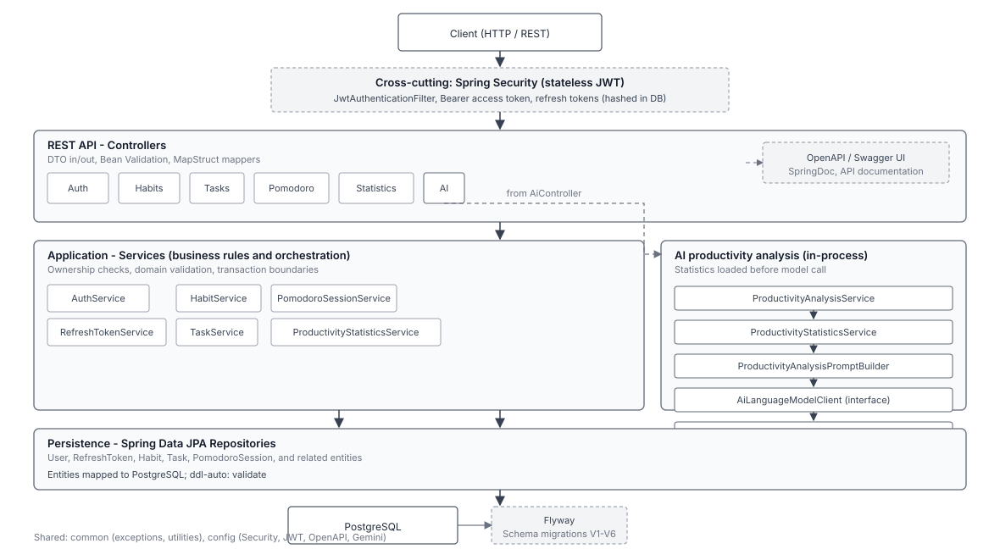

# Lumind Intelligence API

[](https://openjdk.org/)
[](https://spring.io/projects/spring-boot)
[](https://www.postgresql.org/)
[](https://maven.apache.org/)
[](LICENSE)

Production-oriented REST backend for **Lumind**, a productivity platform. The API covers authentication, habits, tasks, Pomodoro sessions, read-only productivity metrics, and AI-assisted analysis—implemented with Spring Boot, PostgreSQL, and automated quality gates suitable for portfolio and technical review.

**Release:** `v1.0.0` — core backend scope is complete and frozen; optional improvements are documented as technical debt, not missing core features.

---

## Overview

Lumind Intelligence API demonstrates maintainable backend engineering: feature-based modules, stateless JWT security, schema evolution with Flyway, OpenAPI documentation, and a broad automated test suite with CI enforcement.

Design goals:

- **Feature cohesion** — each domain (auth, habits, tasks, etc.) owns its web, service, persistence, and mapping layers.
- **Explicit boundaries** — controllers expose DTOs only; business rules live in services.
- **Operational clarity** — migrations, validation, consistent error handling, and observable health endpoints.

Internal architecture notes: [docs/architecture/ARCHITECTURE.md](docs/architecture/ARCHITECTURE.md).

---

## Key features

| Area | Implementation |
|------|----------------|
| **Authentication** | Register, login, refresh, logout; BCrypt password hashing |
| **JWT** | Short-lived access tokens; longer-lived refresh tokens with unique `jti` |
| **Refresh tokens** | Stored as SHA-256 hashes; rotation on refresh; reuse of revoked tokens triggers session-wide revocation |
| **Authorization** | Stateless Bearer JWT; resource operations scoped to the authenticated user |
| **Habits / Tasks / Pomodoro** | Full CRUD REST APIs with ownership checks |
| **Statistics** | Read-only productivity metrics under `/api/v1/statistics` |
| **AI analysis** | Productivity insights from statistics via `AiLanguageModelClient` (Gemini-backed; HTTP call is a deliberate stub) |
| **Persistence** | PostgreSQL + JPA (`ddl-auto: validate`) |
| **Migrations** | Flyway `V1`–`V6` (users, refresh tokens, habits, tasks, pomodoro sessions, statistics indexes) |
| **API docs** | SpringDoc OpenAPI + Swagger UI |
| **Testing** | **174** automated tests (unit + MockMvc integration) |
| **Integration DB** | Testcontainers PostgreSQL (requires Docker for `mvn verify`) |
| **CI** | GitHub Actions runs `mvn clean verify` on push and pull request |

---

## Architecture



The codebase uses a **feature-based layout**: each module under `com.lumind.api` typically includes a controller, service, repository, entity, DTOs, and a MapStruct mapper. Shared cross-cutting code (exceptions, utilities, constants) lives in `common`.

Within each feature, responsibilities follow familiar Spring layering—thin controllers, services for business rules, repositories for persistence—aligned with SOLID-style separation without claiming a full hexagonal/Clean Architecture stack.

```
Request → Controller (DTO in/out) → Service → Repository → PostgreSQL
                ↓
         Global exception handling · Bean Validation
```

---

## Security model

| Mechanism | Behavior |
|-----------|----------|
| **Access token** | JWT (HMAC), sent as `Authorization: Bearer`; validated on protected routes |
| **Refresh token** | JWT with rotation tracking; only a hash is persisted |
| **Rotation** | Each successful refresh revokes the previous refresh token and issues a new pair |
| **Reuse detection** | Presenting a revoked refresh token revokes all active refresh tokens for that user |
| **Logout** | Revokes the presented refresh token (idempotent); **does not** invalidate already-issued access tokens—they remain valid until natural expiry (~15 minutes, configurable in `application.yml`) |
| **Ownership** | Habits, tasks, Pomodoro sessions, and statistics are resolved for the authenticated user only |

Public routes include `/api/v1/auth/**`, Swagger/OpenAPI paths, and Actuator `health` / `info`. All other API routes require authentication.

---

## Testing and quality

- **174** tests (`@Test` methods in `src/test`).
- **Unit tests** — services, JWT, refresh-token logic, prompt building, etc. (JUnit 5, Mockito).
- **Integration tests** — HTTP layer with MockMvc and a real PostgreSQL instance via **Testcontainers** (Docker must be available locally and in CI).
- **JaCoCo** — bound to the Maven `verify` phase with enforced minimums: **80%** instruction coverage and **50%** branch coverage (see `pom.xml`).

```bash
mvn clean verify   # compile, run all tests, JaCoCo report, coverage gate
```

---

## AI integration

Productivity analysis is an orchestrated flow:

1. Load statistics for the requested period (overview, tasks, Pomodoro, habits).
2. Build a structured prompt (`ProductivityAnalysisPromptBuilder`).
3. Call `AiLanguageModelClient.generateCompletion`.
4. Parse JSON (summary, insights, recommendations) into the API response.

The default implementation is **`GeminiClient`**, which implements the abstraction and wires `RestClient` + configuration—but **`executeGenerateContentRequest` currently returns a deterministic stub** instead of calling the Gemini HTTP API. The real HTTP path and response parsing are scaffolded for a future change. Configure `GEMINI_API_KEY` when implementing the live integration; the stub does not require it.

---

## Tech stack

| Category | Technologies |
|----------|----------------|
| Runtime | Java 21 |
| Framework | Spring Boot 3.5 (Web, Security, Data JPA, Validation, Actuator) |
| Security | Spring Security (stateless JWT), JJWT 0.13.0 |
| Database | PostgreSQL, Flyway |
| Mapping / boilerplate | MapStruct, Lombok |
| API documentation | SpringDoc OpenAPI 2.8 |
| Build | Maven |
| Testing | JUnit 5, Mockito, Spring Security Test, MockMvc, Testcontainers |
| Quality | JaCoCo (coverage gate on `verify`) |
| CI | GitHub Actions |

---

## API documentation

When the application is running (default port **8080**):

| Resource | URL |
|----------|-----|
| Swagger UI | [http://localhost:8080/swagger-ui.html](http://localhost:8080/swagger-ui.html) |
| OpenAPI JSON | [http://localhost:8080/v3/api-docs](http://localhost:8080/v3/api-docs) |

Paths are configured in `src/main/resources/application.yml` (`springdoc.api-docs.path`, `springdoc.swagger-ui.path`). Use **Authorize** in Swagger UI with a Bearer access token for protected endpoints.

### Endpoint map (summary)

**Public**

| Method | Path | Description |
|--------|------|-------------|
| `POST` | `/api/v1/auth/register` | Register |
| `POST` | `/api/v1/auth/login` | Login |
| `POST` | `/api/v1/auth/refresh` | Refresh tokens |
| `POST` | `/api/v1/auth/logout` | Logout (refresh token revocation) |
| — | `/swagger-ui.html`, `/v3/api-docs` | OpenAPI |
| — | `/actuator/health`, `/actuator/info` | Actuator |

**Protected (JWT Bearer)**

| Method | Path | Description |
|--------|------|-------------|
| CRUD | `/api/v1/habits` | Habits |
| CRUD | `/api/v1/tasks` | Tasks |
| CRUD | `/api/v1/pomodoro-sessions` | Pomodoro sessions |
| `GET` | `/api/v1/statistics/overview` | Productivity overview |
| `GET` | `/api/v1/statistics/tasks` | Task statistics |
| `GET` | `/api/v1/statistics/pomodoro-sessions` | Pomodoro statistics |
| `GET` | `/api/v1/statistics/habits` | Habit statistics |
| `POST` | `/api/v1/ai/productivity-analysis` | AI productivity analysis |

---

## Project structure

```
src/main/java/com/lumind/api/
├── LumindIntelligenceApiApplication.java
├── config/              # Security, JWT, OpenAPI, Gemini
├── auth/
├── user/                # User entity/repository (no public profile API in v1.0)
├── habit/
├── task/
├── pomodoro/
├── statistics/
├── ai/
└── common/              # Shared exceptions, utilities, constants

src/main/resources/
├── application.yml
└── db/migration/        # Flyway V1–V6

src/test/java/           # Unit and integration tests
.github/workflows/       # CI (Maven verify)
```

---

## Getting started

### Prerequisites

- **JDK 21**
- **Maven 3.9+**
- **PostgreSQL** (local instance for running the app)
- **Docker** (required for integration tests and `mvn verify`; not required only for `spring-boot:run` if you skip tests)

### Run locally

```bash
createdb lumind   # or create database matching DB_NAME
export JWT_SECRET=$(openssl rand -base64 32)
mvn spring-boot:run
```

`JWT_SECRET` is **required** (minimum 256-bit HMAC secret). Copy [`.env.example`](.env.example) for variable names and defaults.

```bash
mvn package              # Build JAR (runs tests; JaCoCo gate is on verify only)
mvn clean verify         # Full pipeline: tests + JaCoCo report and coverage gate (needs Docker)
```

---

## Environment configuration

| Variable | Description | Default |
|----------|-------------|---------|
| `DB_HOST` | PostgreSQL host | `localhost` |
| `DB_PORT` | PostgreSQL port | `5432` |
| `DB_NAME` | Database name | `lumind` |
| `DB_USERNAME` | Database user | `lumind` |
| `DB_PASSWORD` | Database password | `lumind` |
| `SERVER_PORT` | HTTP port | `8080` |
| `JWT_SECRET` | HMAC secret for signing JWTs (≥ 256 bits) | **Required** — generate with `openssl rand -base64 32` |
| `GEMINI_API_KEY` | Gemini API key (for future live HTTP integration) | Optional (stub active today) |

Do not commit real secrets. See [`.env.example`](.env.example).

---

## CI/CD

The [CI workflow](.github/workflows/ci.yml) runs on every push and pull request:

- JDK **21** (Temurin), Maven cache
- `mvn clean verify -B` — unit and integration tests, including Testcontainers PostgreSQL, and the JaCoCo quality gate

---

## Project status

| Item | Status |
|------|--------|
| Version | **v1.0.0** (portfolio release) |
| Core REST API | Complete and frozen |
| User profile endpoints | Out of scope for v1.0 (persistence layer exists) |
| Gemini HTTP client | Stub; optional follow-up |

This repository is intended as a **completed backend portfolio piece**, not an active multi-sprint roadmap.

### Future improvements (optional)

- Replace `GeminiClient` stub with real Gemini `generateContent` HTTP calls and response parsing
- Scheduled cleanup of expired/revoked refresh tokens in the database
- Container images (`Dockerfile` / compose) for local deployment
- Further performance or security hardening (e.g. reducing per-request user lookups in the JWT filter)

---

## Documentation

- [AGENTS.md](AGENTS.md) — project standards and architecture rules for contributors
- [docs/](docs/) — domain model, ADRs, specifications, development log

---

## License

[MIT](LICENSE) — Copyright (c) 2026 MeddinaDev
