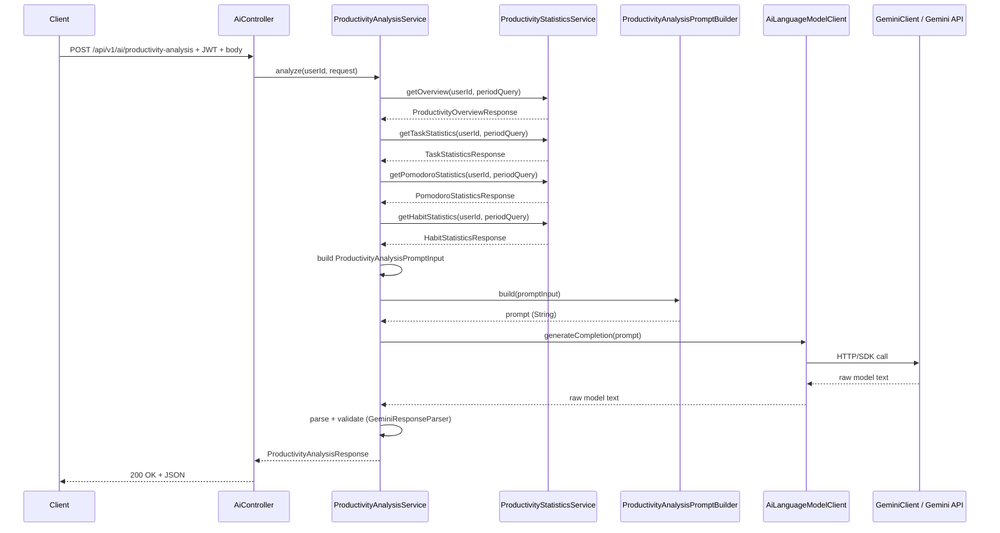

# Especificación técnica — AI Productivity Analysis (Sprint 7)

Documento de diseño **implementado** (Sprint 7 completado; stub Gemini).

| Campo | Valor |
|-------|-------|
| Sprint | 7 — Artificial Intelligence |
| Fase roadmap | Fase 7 — AI Productivity Analysis |
| Estado | Implementada (2026-07-26) |
| Versión API | `v1` |
| Base path | `/api/v1/ai` |

---

## 1. Objetivos

### 1.1 Objetivo general

Ofrecer análisis de productividad generado por un modelo de lenguaje a partir de las **métricas agregadas** ya calculadas por el módulo Statistics, sin acceder directamente a los datos maestros de Habit, Task o Pomodoro, y sin persistir respuestas de IA en Sprint 7.

### 1.2 Objetivos funcionales

| ID | Objetivo |
|----|----------|
| AI-01 | Generar un informe de productividad en lenguaje natural para el usuario autenticado en un periodo configurable. |
| AI-02 | Extraer insights accionables a partir de KPIs de tareas, sesiones Pomodoro y hábitos. |
| AI-03 | Proponer recomendaciones personalizadas basadas exclusivamente en métricas agregadas del periodo. |
| AI-04 | Restringir el análisis al usuario autenticado (JWT Bearer). |

### 1.3 Objetivos no funcionales

| ID | Objetivo |
|----|----------|
| AI-NF-01 | El resto del sistema no debe depender de la API de Gemini; la integración queda encapsulada tras una abstracción de proveedor. |
| AI-NF-02 | El prompt no se construye en el Service; un componente dedicado (`PromptBuilder`) lo genera a partir de datos agregados. |
| AI-NF-03 | Respuestas tipadas (`ProductivityAnalysisResponse`) y documentación OpenAPI. |
| AI-NF-04 | Manejo de errores de infraestructura IA con códigos HTTP explícitos y mensajes seguros (sin filtrar detalles internos del proveedor). |
| AI-NF-05 | Sin persistencia de prompts ni respuestas en Sprint 7 (análisis stateless). |

### 1.4 Alcance Sprint 7

**Incluido:**

- Feature `ai`: controller, service, prompt builder, cliente Gemini encapsulado, DTOs, configuración y excepciones de dominio IA.
- Endpoint POST protegido bajo `/api/v1/ai`.
- Consumo de `ProductivityStatisticsService` como única fuente de datos de productividad.
- Integración con Gemini API (modelo configurable).

**Excluido:**

- Persistencia de análisis, historial o caché de respuestas IA.
- Acceso directo a repositories o services de `habit`, `task` o `pomodoro`.
- Streaming de respuestas (SSE/WebSocket).
- Fine-tuning, embeddings o RAG.
- Rate limiting server-side (consideración futura; diseño preparado para ello).
- Multi-proveedor simultáneo (solo un proveedor activo por configuración).
- Envío de datos personales identificables (email, nombre) al modelo.

### 1.5 Aprovechamiento de módulos existentes (sin romper desacoplamiento)

| Módulo | Rol respecto a AI | Dependencia del módulo AI |
|--------|-------------------|---------------------------|
| **Authentication** | Protección JWT; identidad vía `AuthenticatedUser` | Solo vía `@AuthenticationPrincipal` en controller (sin dependencia de `AuthService`). |
| **User** | Identificador de usuario (`UUID`) para filtrar estadísticas | Indirecta: el `userId` llega desde el token JWT. |
| **Habit** | Datos maestros de hábitos | **Prohibida.** AI no accede a `HabitRepository` ni `HabitService`. |
| **Task** | Datos maestros de tareas | **Prohibida.** AI no accede a `TaskRepository` ni `TaskService`. |
| **Pomodoro** | Datos maestros de sesiones | **Prohibida.** AI no accede a `PomodoroSessionRepository` ni `PomodoroSessionService`. |
| **Statistics** | Read model de productividad; fuente única de métricas agregadas | **Permitida y obligatoria.** AI depende de `ProductivityStatisticsService` y reutiliza sus DTOs de respuesta. |

**Principio de desacoplamiento:** AI es un **consumidor downstream** del read model Statistics. Las features de dominio (Habit, Task, Pomodoro) permanecen ajenas a IA. Si cambia el esquema interno de Task, AI no se ve afectado mientras Statistics mantenga su contrato de métricas.

```
┌─────────┐   ┌─────────┐   ┌──────────┐
│  Habit  │   │  Task   │   │ Pomodoro │
└────┬────┘   └────┬────┘   └────┬─────┘
     │             │             │
     └─────────────┼─────────────┘
                   ▼
         ┌─────────────────────┐
         │     Statistics      │  ← read model (JPQL agregado)
         │ ProductivityStats   │
         │      Service        │
         └──────────┬──────────┘
                    │ DTOs agregados
                    ▼
         ┌─────────────────────┐
         │         AI          │  ← análisis + prompt + Gemini
         │ ProductivityAnalysis│
         │      Service        │
         └─────────────────────┘
```

---

## 2. Casos de uso

| ID | Caso de uso | Actor | Descripción |
|----|-------------|-------|-------------|
| UC-AI-01 | Generar análisis de productividad | Usuario autenticado | Solicita un informe en lenguaje natural que interpreta sus KPIs de tareas, Pomodoro y hábitos en un periodo dado. |
| UC-AI-02 | Obtener insights de productividad | Usuario autenticado | Recibe observaciones estructuradas (patrones, fortalezas, áreas de mejora) derivadas de las métricas agregadas. |
| UC-AI-03 | Obtener recomendaciones accionables | Usuario autenticado | Recibe sugerencias concretas y priorizadas para mejorar su productividad en el periodo analizado. |

**Flujo común (UC-AI-01 a UC-AI-03):** un único endpoint consolida informe, insights y recomendaciones en una sola respuesta estructurada. Los casos de uso se distinguen por la sección del payload devuelto, no por endpoints separados en Sprint 7.

---

## 3. Endpoints

Todos requieren `Authorization: Bearer <access_token>`.

### 3.1 POST `/api/v1/ai/productivity-analysis`

| Aspecto | Detalle |
|---------|---------|
| **Finalidad** | Generar un análisis de productividad asistido por IA para el periodo solicitado, incluyendo resumen narrativo, insights y recomendaciones. |
| **Request** | Body JSON: `ProductivityAnalysisRequest` (`from`, `to` opcionales). Misma semántica de periodo que Statistics (`StatisticsPeriodQuery`). |
| **Response** | `200 OK` — `ProductivityAnalysisResponse`. |
| **Origen de los datos** | Métricas obtenidas vía `ProductivityStatisticsService`: `getOverview`, `getTaskStatistics`, `getPomodoroStatistics`, `getHabitStatistics`. El modelo Gemini procesa el prompt construido a partir de esos DTOs. |
| **Reglas de negocio** | Periodo validado por Statistics (`from` ≤ `to`, máximo 366 días). Solo datos del usuario autenticado. Sin PII en el prompt. Si no hay actividad en el periodo, el análisis se genera igualmente (mensaje orientativo, no error). POST por invocación externa con coste/latencia. Respuesta parseada y validada antes de devolverla al cliente. |

**Códigos de error previstos:**

| Código | Condición |
|--------|-----------|
| `400` | Periodo inválido (`InvalidStatisticsPeriodException`, reutilizada). |
| `401` | Token ausente o inválido. |
| `429` | Límite de uso del proveedor IA excedido. |
| `502` | Respuesta del modelo inválida o no parseable. |
| `503` | Proveedor IA no disponible o configuración incorrecta (API key ausente). |
| `504` | Timeout de la llamada al proveedor IA. |

**Justificación POST vs GET:** la operación implica una llamada externa con latencia, posible coste y efectos fuera del sistema de archivos local; POST evita cacheo involuntario y deja margen para ampliar el body (p. ej. foco del análisis) sin romper idempotencia REST de recursos de lectura.

---

## 4. DTOs

Convenciones: **records**, campos en inglés, fechas como `Instant` (UTC).

### 4.1 Request DTOs

```java
// ai/dto/request/ProductivityAnalysisRequest.java
public record ProductivityAnalysisRequest(
        Instant from,
        Instant to
) {}
```

Equivalente semántico a `StatisticsPeriodQuery`. En implementación se evaluará reutilizar directamente `StatisticsPeriodQuery` para evitar duplicación; si se mantiene record propio, debe compartir las mismas reglas de validación y defaults documentadas en Statistics.

Binding vía `@Valid` + `@RequestBody` en controller.

### 4.2 Response DTOs

```java
// ai/dto/response/ProductivityAnalysisResponse.java
public record ProductivityAnalysisResponse(
        Instant from,
        Instant to,
        Instant generatedAt,
        String summary,
        List<String> insights,
        List<String> recommendations
) {}
```

| Campo | Descripción |
|-------|-------------|
| `from`, `to` | Periodo efectivo analizado (eco de Statistics). |
| `generatedAt` | Marca temporal UTC de generación del análisis. |
| `summary` | Párrafo narrativo de síntesis (2–4 frases). |
| `insights` | Lista ordenada de observaciones sobre patrones detectados. |
| `recommendations` | Lista ordenada de acciones concretas sugeridas. |

**Notas:**

- No se expone el prompt ni la respuesta cruda del modelo al cliente.
- No se requiere MapStruct (sin entidades JPA propias).
- El Service valida que `summary`, `insights` y `recommendations` no estén vacíos tras el parseo; si lo están → error de respuesta inválida.

### 4.3 DTO interno para Prompt Builder (no expuesto en API)

```java
// ai/prompt/model/ProductivityAnalysisPromptInput.java
public record ProductivityAnalysisPromptInput(
        Instant from,
        Instant to,
        ProductivityOverviewResponse overview,
        TaskStatisticsResponse tasks,
        PomodoroStatisticsResponse pomodoro,
        HabitStatisticsResponse habits
) {}
```

Record **interno al módulo AI** que agrupa exclusivamente DTOs de Statistics. Es la única entrada permitida del `PromptBuilder`.

---

## 5. Arquitectura del módulo

```
ai/
├── AiController.java
├── service/
│   └── ProductivityAnalysisService.java
├── prompt/
│   ├── ProductivityAnalysisPromptBuilder.java
│   └── model/
│       └── ProductivityAnalysisPromptInput.java
├── client/
│   ├── AiLanguageModelClient.java              // interfaz agnóstica de proveedor
│   └── gemini/
│       ├── GeminiClient.java                   // implementación Gemini
│       └── GeminiResponseParser.java           // parseo JSON/texto → estructura interna
├── dto/
│   ├── request/
│   │   └── ProductivityAnalysisRequest.java
│   └── response/
│       └── ProductivityAnalysisResponse.java
├── config/
│   ├── GeminiProperties.java                   // @ConfigurationProperties
│   └── GeminiConfig.java                       // beans del cliente
└── exception/
    ├── AiServiceUnavailableException.java
    ├── AiRequestTimeoutException.java
    ├── AiResponseInvalidException.java
    ├── AiConfigurationException.java
    └── AiRateLimitExceededException.java
```

### 5.1 Responsabilidad de cada componente

| Componente | Responsabilidad | Justificación |
|------------|-----------------|---------------|
| **AiController** | Recibir POST, validar body, extraer `AuthenticatedUser`, delegar al service, devolver DTO de respuesta. | Capa HTTP delgada; sin lógica de negocio ni construcción de prompts. |
| **ProductivityAnalysisService** | Orquestar el flujo: obtener estadísticas, invocar prompt builder, llamar al cliente IA, parsear/validar respuesta, mapear a DTO de API. | Punto único de coordinación; concentra reglas de negocio del análisis (periodo, usuario, validación de salida). **No** construye prompts ni conoce detalles HTTP de Gemini. |
| **ProductivityAnalysisPromptBuilder** | Transformar `ProductivityAnalysisPromptInput` en un `String` prompt estructurado (system + user instructions, métricas serializadas). | Separación de concerns: plantillas, tono, idioma y formato del prompt evolucionan sin tocar orquestación ni cliente HTTP. Facilita tests unitarios del prompt con datos fijos. |
| **ProductivityAnalysisPromptInput** | Snapshot inmutable de métricas agregadas para el periodo. | Contrato explícito entre Service y PromptBuilder; impide filtrar entidades JPA o PII al prompt. |
| **AiLanguageModelClient** | Interfaz con operación `generateCompletion(String prompt)` (o similar) que devuelve texto crudo del modelo. | Desacopla el dominio del proveedor; permite sustituir Gemini sin modificar Service ni Controller. |
| **GeminiClient** | Implementación HTTP/SDK de Gemini: autenticación, request, timeout, mapeo de errores HTTP del proveedor a excepciones internas del paquete `client.gemini`. | Encapsula toda dependencia de la API externa en un subpaquete. |
| **GeminiResponseParser** | Convertir respuesta cruda del modelo en estructura intermedia (`ParsedAnalysis`: summary, insights, recommendations). | El Service no parsea JSON/texto libre; responsabilidad acotada y testeable. |
| **GeminiProperties / GeminiConfig** | API key, modelo, URL base, timeout, temperatura. Validación de configuración al arranque. | Configuración tipada alineada con `JwtProperties`; fallo temprano si falta `GEMINI_API_KEY`. |
| **DTOs request/response** | Contrato REST público. | Consistencia con el resto de features. |
| **Excepciones `ai/exception`** | Errores de dominio IA traducidos por `GlobalExceptionHandler`. | Mensajes seguros y códigos HTTP predecibles. |

### 5.2 Dependencias permitidas y prohibidas

**Permitidas:**

- `statistics.service.ProductivityStatisticsService`
- `statistics.dto.request.StatisticsPeriodQuery` (o equivalente)
- `statistics.dto.response.*` (overview, tasks, pomodoro, habits)
- `statistics.exception.InvalidStatisticsPeriodException` (propagada sin reinterpretar)
- `auth.model.AuthenticatedUser` (solo en controller)
- `common.exception.ErrorResponse` (vía handler global)

**Prohibidas:**

- Repositories o services de `habit`, `task`, `pomodoro`, `user`.
- Entidades JPA de otras features.
- Importar SDK/clases Gemini fuera de `ai.client.gemini` y `ai.config`.
- Construir prompts dentro de `ProductivityAnalysisService`.

---

## 6. Flujo completo (HTTP → respuesta del modelo)



**Pasos detallados:**

1. **Entrada HTTP:** `AiController` recibe POST con JWT y body opcional (`from`, `to`).
2. **Identidad:** Extrae `userId` de `AuthenticatedUser`.
3. **Obtención de métricas:** `ProductivityAnalysisService` invoca cuatro métodos de `ProductivityStatisticsService` con el mismo `StatisticsPeriodQuery`. Statistics valida el periodo; si es inválido, lanza `InvalidStatisticsPeriodException` → `400`.
4. **Agregación para prompt:** El service compone `ProductivityAnalysisPromptInput` con los cuatro DTOs de respuesta.
5. **Construcción del prompt:** `ProductivityAnalysisPromptBuilder.build(input)` produce un string con instrucciones fijas + métricas serializadas (JSON o texto tabular). **El Service no modifica el prompt.**
6. **Invocación IA:** `AiLanguageModelClient.generateCompletion(prompt)` delega en `GeminiClient`.
7. **Llamada externa:** GeminiClient aplica timeout, API key y modelo configurados; captura errores HTTP/red del proveedor.
8. **Parseo:** `GeminiResponseParser` extrae `summary`, `insights`, `recommendations` de la respuesta (formato acordado en el prompt, p. ej. JSON estructurado).
9. **Validación de negocio:** Service verifica campos obligatorios no vacíos.
10. **Respuesta API:** Mapeo a `ProductivityAnalysisResponse` con `generatedAt = Instant.now()` y devolución `200 OK`.

---

## 7. Estrategia de construcción del prompt

### 7.1 Decisión

El prompt **no se construye en `ProductivityAnalysisService`**. Un componente dedicado, `ProductivityAnalysisPromptBuilder`, es el único responsable de generar el texto enviado al modelo.

### 7.2 Entrada exclusiva: datos agregados de Statistics

El builder recibe únicamente `ProductivityAnalysisPromptInput`, compuesto por:

- `ProductivityOverviewResponse`
- `TaskStatisticsResponse` (incluye tendencia diaria)
- `PomodoroStatisticsResponse` (incluye tendencia diaria)
- `HabitStatisticsResponse`

**No** recibe entidades JPA, emails, títulos de tareas ni nombres de hábitos.

### 7.3 Estructura del prompt (borrador)

1. **System / instrucciones:** rol del asistente (coach de productividad), idioma de salida (español), tono profesional y conciso, limitaciones del modelo de datos (sin completados de hábitos, `updatedAt` como proxy de completado de tareas).
2. **Contexto temporal:** `from`, `to`, duración en días.
3. **Bloque de métricas:** serialización estructurada (JSON recomendado) de los cuatro DTOs.
4. **Formato de salida exigido:** JSON con campos `summary` (string), `insights` (array de strings), `recommendations` (array de strings) para facilitar parseo determinista.
5. **Restricciones:** no inventar métricas; basarse solo en los datos proporcionados; si el volumen es cero, indicarlo explícitamente en el resumen.

### 7.4 Justificación

| Beneficio | Explicación |
|-----------|-------------|
| **Single Responsibility** | El Service orquesta; el Builder especializa en plantillas y evolución del prompt. |
| **Testabilidad** | Tests unitarios del builder con `ProductivityAnalysisPromptInput` fijo, sin mock de Gemini ni Statistics. |
| **Seguridad** | Punto único para auditar qué datos salen hacia el proveedor externo. |
| **Evolución** | Cambios de modelo, idioma o few-shot examples no requieren tocar lógica de orquestación. |
| **Desacoplamiento** | El builder depende de DTOs de Statistics, no de repositories de dominio. |

---

## 8. Estrategia de integración con Gemini

### 8.1 Encapsulamiento

Toda dependencia de Gemini queda confinada a:

- `ai.client.gemini.*`
- `ai.config.*` (propiedades y beans)

El resto del proyecto interactúa únicamente con la interfaz `AiLanguageModelClient`.

```java
// ai/client/AiLanguageModelClient.java
public interface AiLanguageModelClient {
    String generateCompletion(String prompt);
}
```

### 8.2 Configuración prevista

```yaml
# application.yml (diseño; no implementado en Fase 32)
lumind:
  ai:
    gemini:
      api-key: ${GEMINI_API_KEY:}
      model: gemini-2.0-flash
      base-url: https://generativelanguage.googleapis.com
      timeout: 30s
      temperature: 0.4
```

`GeminiProperties` validará presencia de API key en perfil de producción; en test se usará mock/stub del cliente.

### 8.3 Sustitución de proveedor

Para reemplazar Gemini por OpenAI, Anthropic u otro:

1. Crear `OpenAiClient implements AiLanguageModelClient` en `ai.client.openai`.
2. Registrar el bean activo vía `@ConditionalOnProperty(name = "lumind.ai.provider", havingValue = "openai")` (propiedad a definir en ADR).
3. **Sin cambios** en `AiController`, `ProductivityAnalysisService`, `ProductivityAnalysisPromptBuilder` ni DTOs públicos.

El parseo de respuesta puede requerir un parser específico por proveedor (`GeminiResponseParser` vs `OpenAiResponseParser`) inyectado junto al cliente, manteniendo la interfaz del Service estable.

### 8.4 Justificación

| Principio | Aplicación |
|-----------|------------|
| **Dependency Inversion** | Service depende de abstracción, no de Gemini SDK. |
| **Open/Closed** | Nuevo proveedor = nueva implementación + config, sin modificar orquestación. |
| **Feature isolation** | Ningún otro módulo importa clases Gemini. |
| **Testabilidad** | Tests del Service con `AiLanguageModelClient` mock devuelve texto fijo. |

---

## 9. Estrategia de manejo de errores

Excepciones de dominio en `ai/exception/`; handlers en `GlobalExceptionHandler`. **No implementadas en Fase 32**; diseño acordado:

| Escenario | Excepción propuesta | HTTP | Mensaje cliente (constante) | Comportamiento interno |
|-----------|---------------------|------|----------------------------|------------------------|
| API Gemini no disponible (5xx, conexión rechazada) | `AiServiceUnavailableException` | `503` | "AI analysis service is temporarily unavailable" | Log WARN con código HTTP; sin stack del proveedor al cliente. |
| Timeout de llamada | `AiRequestTimeoutException` | `504` | "AI analysis request timed out" | Log WARN; timeout configurable en `GeminiProperties`. |
| Respuesta vacía, JSON malformado o campos obligatorios ausentes | `AiResponseInvalidException` | `502` | "AI analysis could not be processed" | Log ERROR con fragmento truncado de respuesta (solo servidor). |
| API key ausente o configuración inválida al arranque / en runtime | `AiConfigurationException` | `503` | "AI analysis service is not configured" | Fail-fast en startup si perfil prod; endpoint devuelve 503 si se detecta en runtime. |
| Límite de uso / rate limit del proveedor (429) | `AiRateLimitExceededException` | `429` | "AI analysis rate limit exceeded" | Log WARN; opcional header `Retry-After` si el proveedor lo expone. |
| Periodo inválido | `InvalidStatisticsPeriodException` (Statistics) | `400` | "Invalid statistics period" | Reutilizar handler existente; no duplicar validación en AI. |
| Error no controlado | `Exception` (handler genérico) | `500` | "An unexpected error occurred" | Sin filtrar detalles internos. |

**Principios:**

- Nunca exponer API keys, prompts completos ni respuestas crudas del modelo al cliente.
- Errores del proveedor se traducen a excepciones de dominio IA en `GeminiClient`, no en el Service.
- El Service solo lanza excepciones de dominio por fallos de parseo/validación post-respuesta.

---

## 10. Reglas de negocio adicionales

| ID | Regla |
|----|-------|
| AI-R01 | El análisis solo incluye datos del `userId` autenticado. |
| AI-R02 | Periodo: mismos defaults y límites que Statistics (30 días UTC por defecto, máximo 366 días). |
| AI-R03 | Sin actividad en el periodo no es error; el prompt incluye métricas en cero y el modelo debe reconocerlo. |
| AI-R04 | No persistir prompts ni respuestas en Sprint 7. |
| AI-R05 | No enviar PII al modelo (email, nombre, títulos de tareas, nombres de hábitos). |
| AI-R06 | Documentar en OpenAPI que el análisis depende de un servicio externo y puede fallar con 5xx. |
| AI-R07 | `insights` y `recommendations`: mínimo 1 elemento cada uno en respuesta válida; máximo razonable (p. ej. 10) definido en parser para evitar payloads abusivos. |

---

## 11. Decisiones arquitectónicas — ADRs

| ADR | Tema | Enlace |
|-----|------|--------|
| **009** | AI depende exclusivamente de Statistics | [009-ai-statistics-dependency.md](../../decisions/009-ai-statistics-dependency.md) |
| **010** | Encapsulamiento del proveedor Gemini | [010-ai-provider-encapsulation.md](../../decisions/010-ai-provider-encapsulation.md) |
| **011** | PromptBuilder separado del Service | [011-prompt-builder-separation.md](../../decisions/011-prompt-builder-separation.md) |
| **012** | Análisis stateless sin persistencia | [012-stateless-ai-analysis.md](../../decisions/012-stateless-ai-analysis.md) |

### Deuda técnica aceptada

- `GeminiClient` opera con **stub HTTP**; integración real con Gemini API pendiente.
- Sin rate limiting server-side en endpoint AI.
- Sin persistencia de historial de análisis (por diseño ADR 012).
- Sin streaming de respuestas.

---

## 12. Plan de implementación (completado)

| Fase | Contenido | Estado |
|------|-----------|--------|
| 33 | `GeminiProperties`, `GeminiConfig`, `AiLanguageModelClient`, `GeminiClient` | ✅ (stub) |
| 34 | `ProductivityAnalysisPromptInput`, `ProductivityAnalysisPromptBuilder` | ✅ |
| 35 | `ProductivityAnalysisService` + DTOs | ✅ |
| 36 | Excepciones IA + `GlobalExceptionHandler` | ✅ |
| 37 | Tests unitarios e integración MockMvc | ✅ |
| 38 | Cierre Sprint 7 | ✅ |
| 40 | Hardening: transacción LLM, `AiResponseInvalidException` → 502 | ✅ |

---

## 13. Referencias

- [docs/ROADMAP.md](../../ROADMAP.md) — Fase 7
- [docs/SPRINTS.md](../../SPRINTS.md) — Sprint 7
- [docs/spec/statistics/SPECIFICATION.md](../statistics/SPECIFICATION.md) — Read model de métricas
- [docs/decisions/009-ai-statistics-dependency.md](../../decisions/009-ai-statistics-dependency.md)
- [docs/decisions/010-ai-provider-encapsulation.md](../../decisions/010-ai-provider-encapsulation.md)
- [docs/decisions/011-prompt-builder-separation.md](../../decisions/011-prompt-builder-separation.md)
- [docs/decisions/012-stateless-ai-analysis.md](../../decisions/012-stateless-ai-analysis.md)
