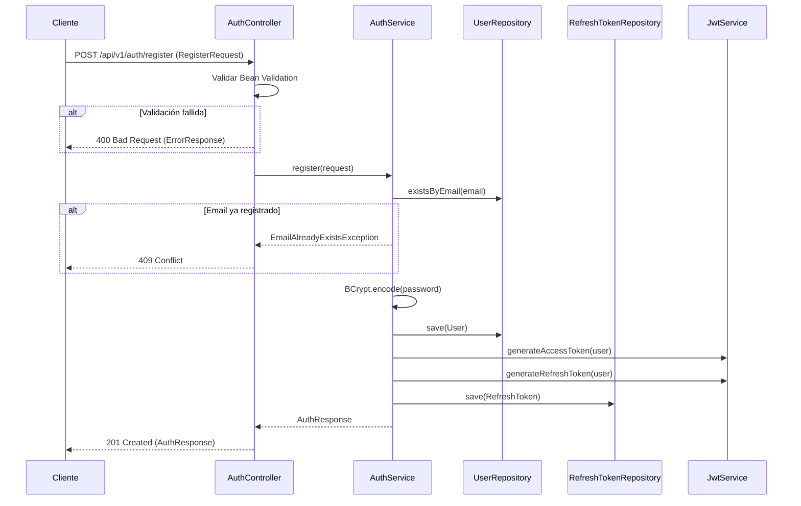
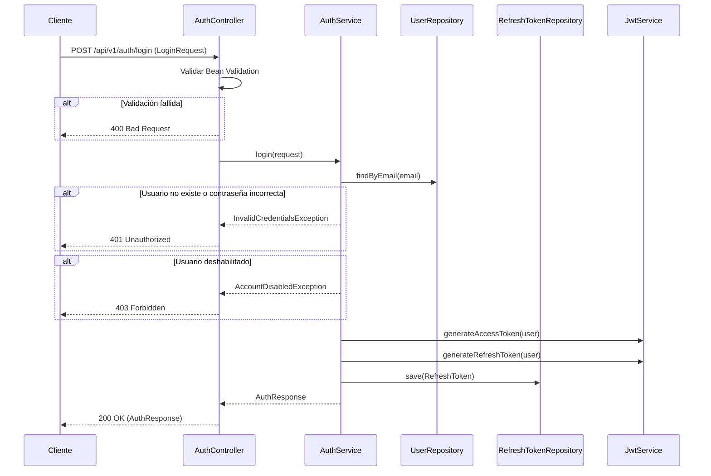
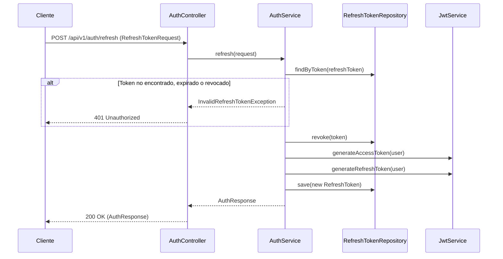

# Especificación técnica — Autenticación (Sprint 2)

Documento de diseño aprobado. **Pendiente de implementación** según plan del Sprint 2.

| Campo | Valor |
|-------|-------|
| Sprint | 2 — Authentication |
| Fase roadmap | Fase 2 — Authentication (JWT) + Users |
| Estado | Aprobada (2026-07-06) |
| Versión API | `v1` |
| Base path | `/api/v1/auth` |

---

## 1. Objetivos

### 1.1 Objetivo general

Implementar un sistema de autenticación basado en **JWT** que permita a los usuarios registrarse, iniciar sesión y acceder a recursos protegidos de la API mediante tokens Bearer, sustituyendo la autenticación HTTP Basic actual.

### 1.2 Objetivos funcionales

| ID | Objetivo |
|----|----------|
| AUTH-01 | Permitir el registro de nuevos usuarios con email y contraseña. |
| AUTH-02 | Permitir el inicio de sesión con credenciales válidas y devolver tokens JWT. |
| AUTH-03 | Permitir la renovación de la sesión mediante refresh token. |
| AUTH-04 | Proteger todos los endpoints de negocio con validación JWT en cada petición. |
| AUTH-05 | Mantener endpoints públicos únicamente para registro, login, refresh y recursos de infraestructura (Swagger, health). |

### 1.3 Objetivos no funcionales

| ID | Objetivo |
|----|----------|
| AUTH-NF-01 | Las contraseñas nunca se almacenan en texto plano; solo hashes BCrypt. |
| AUTH-NF-02 | Los tokens de acceso tienen vida corta para limitar el impacto de filtraciones. |
| AUTH-NF-03 | Los mensajes de error no revelan si un email existe en el sistema (anti-enumeración). |
| AUTH-NF-04 | Todas las respuestas de error siguen un formato consistente (`ErrorResponse`). |
| AUTH-NF-05 | Todos los endpoints quedan documentados en OpenAPI con esquema de seguridad Bearer. |

### 1.4 Alcance del Sprint 2

**Incluido:**

- Feature `auth`: registro, login, refresh, generación y validación de JWT, filtro de seguridad.
- Entidad `User` y migración Flyway mínima necesaria para autenticación (tabla `users`).
- Sustitución de HTTP Basic por JWT en `SecurityConfig`.
- DTOs, validaciones, manejo de errores y documentación Swagger del módulo auth.

**Excluido (fuera de alcance de este sprint):**

- Gestión de perfil de usuario (`GET/PUT /api/v1/users/me`) — feature `user`, puede abordarse en el mismo sprint solo si se aprueba ampliación de alcance.
- Recuperación de contraseña / verificación de email.
- OAuth2 / login social.
- MFA (autenticación multifactor).
- Blacklist de tokens / logout server-side.
- Rate limiting (documentado como consideración futura).

### 1.5 Relación con otras features

```
auth/          → flujos de registro, login, refresh; emisión y validación de JWT
user/          → entidad User, UserRepository; perfil y datos de usuario (futuro)
common/        → ErrorResponse, excepciones compartidas, utilidades JWT si aplica
config/        → SecurityConfig, JwtProperties, OpenApiConfig
```

El registro **crea** un registro en `users`, pero la persistencia del usuario pertenece al dominio `user`. El service de auth coordina con `UserRepository`; no expone la entidad JPA en la API.

---

## 2. Endpoints

### 2.1 Resumen

| Método | Ruta | Auth | Descripción |
|--------|------|------|-------------|
| `POST` | `/api/v1/auth/register` | Pública | Registro de nuevo usuario |
| `POST` | `/api/v1/auth/login` | Pública | Inicio de sesión |
| `POST` | `/api/v1/auth/refresh` | Pública | Renovación de access token |

### 2.2 Rutas públicas (sin JWT)

Además de los endpoints de auth, permanecen públicos:

| Ruta | Motivo |
|------|--------|
| `/v3/api-docs/**` | Documentación OpenAPI |
| `/swagger-ui/**`, `/swagger-ui.html` | Interfaz Swagger |
| `/actuator/health` | Health check |
| `/actuator/info` | Info de aplicación |

Todas las demás rutas requieren header `Authorization: Bearer <access_token>`.

### 2.3 Detalle por endpoint

#### POST `/api/v1/auth/register`

Registra un nuevo usuario y devuelve tokens de autenticación (registro con auto-login).

**Request body:** `RegisterRequest`

**Response:** `201 Created` — `AuthResponse`

**Headers de respuesta:**

```
Content-Type: application/json
```

---

#### POST `/api/v1/auth/login`

Autentica un usuario existente con email y contraseña.

**Request body:** `LoginRequest`

**Response:** `200 OK` — `AuthResponse`

---

#### POST `/api/v1/auth/refresh`

Emite un nuevo par de tokens a partir de un refresh token válido. Implementa **rotación de refresh token**: el token usado se invalida y se emite uno nuevo.

**Request body:** `RefreshTokenRequest`

**Response:** `200 OK` — `AuthResponse`

---

## 3. Flujo de registro



### 3.1 Pasos detallados

1. El cliente envía `RegisterRequest` con email, contraseña, nombre y apellido.
2. `AuthController` valida el DTO con Bean Validation (`@Valid`).
3. `AuthService` comprueba que el email no exista en base de datos.
4. Se codifica la contraseña con `BCryptPasswordEncoder` (strength por defecto: 10).
5. Se persiste el `User` con estado activo (`enabled = true`).
6. Se generan access token y refresh token.
7. Se persiste el refresh token en tabla `refresh_tokens`.
8. Se devuelve `AuthResponse` con tokens y datos públicos del usuario.

### 3.2 Reglas de negocio

- Un email solo puede registrarse una vez (unicidad a nivel de BD e índice único).
- Tras registro exitoso, el usuario queda autenticado sin necesidad de un login adicional.
- No se devuelve ni se registra la contraseña en logs ni en la respuesta.

---

## 4. Flujo de login



### 4.1 Pasos detallados

1. El cliente envía `LoginRequest` con email y contraseña.
2. Se valida el DTO con Bean Validation.
3. Se busca el usuario por email.
4. Si no existe o la contraseña no coincide con el hash almacenado → `401` con mensaje genérico.
5. Si el usuario existe pero `enabled = false` → `403 Forbidden`.
6. Se generan y persisten nuevos tokens (cada login emite un refresh token adicional; ver sección de seguridad sobre múltiples sesiones).
7. Se devuelve `AuthResponse`.

### 4.2 Anti-enumeración

Tanto si el email no existe como si la contraseña es incorrecta, la respuesta debe ser idéntica:

- **HTTP:** `401 Unauthorized`
- **Mensaje:** `"Invalid email or password"`

No usar mensajes distintos como *"User not found"* vs *"Wrong password"*.

---

## 5. Flujo de refresh



### 5.1 Rotación de refresh token

Cada uso válido de un refresh token:

1. Invalida el token presentado (`revoked = true`).
2. Emite un nuevo access token y un nuevo refresh token.
3. Persiste el nuevo refresh token.

Si un refresh token ya revocado se reutiliza (posible robo), el sistema debe registrar un evento de seguridad en logs (nivel `WARN`) y rechazar la petición con `401`.

---

## 6. DTOs

> **Convención:** nombres de clases y campos en **inglés** (código). Tipos JSON en camelCase.

### 6.1 Request DTOs

#### `RegisterRequest`

| Campo | Tipo JSON | Validaciones | Descripción |
|-------|-----------|--------------|-------------|
| `email` | `string` | `@NotBlank`, `@Email`, `@Size(max = 255)` | Email único del usuario |
| `password` | `string` | `@NotBlank`, `@Size(min = 8, max = 128)` | Contraseña en texto plano (solo en tránsito HTTPS) |
| `firstName` | `string` | `@NotBlank`, `@Size(min = 1, max = 100)` | Nombre |
| `lastName` | `string` | `@NotBlank`, `@Size(min = 1, max = 100)` | Apellido |

**Ejemplo:**

```json
{
  "email": "maria.garcia@example.com",
  "password": "SecurePass123",
  "firstName": "María",
  "lastName": "García"
}
```

---

#### `LoginRequest`

| Campo | Tipo JSON | Validaciones | Descripción |
|-------|-----------|--------------|-------------|
| `email` | `string` | `@NotBlank`, `@Email` | Email registrado |
| `password` | `string` | `@NotBlank` | Contraseña |

**Ejemplo:**

```json
{
  "email": "maria.garcia@example.com",
  "password": "SecurePass123"
}
```

---

#### `RefreshTokenRequest`

| Campo | Tipo JSON | Validaciones | Descripción |
|-------|-----------|--------------|-------------|
| `refreshToken` | `string` | `@NotBlank` | Refresh token JWT emitido previamente |

**Ejemplo:**

```json
{
  "refreshToken": "eyJhbGciOiJIUzI1NiIsInR5cCI6IkpXVCJ9..."
}
```

---

### 6.2 Response DTOs

#### `AuthResponse`

Respuesta unificada para register, login y refresh.

| Campo | Tipo JSON | Descripción |
|-------|-----------|-------------|
| `accessToken` | `string` | JWT de acceso |
| `refreshToken` | `string` | JWT de refresh |
| `tokenType` | `string` | Siempre `"Bearer"` |
| `expiresIn` | `number` | Segundos hasta expiración del access token |
| `user` | `UserSummaryResponse` | Datos públicos del usuario autenticado |

**Ejemplo:**

```json
{
  "accessToken": "eyJhbGciOiJIUzI1NiIsInR5cCI6IkpXVCJ9...",
  "refreshToken": "eyJhbGciOiJIUzI1NiIsInR5cCI6IkpXVCJ9...",
  "tokenType": "Bearer",
  "expiresIn": 900,
  "user": {
    "id": "550e8400-e29b-41d4-a716-446655440000",
    "email": "maria.garcia@example.com",
    "firstName": "María",
    "lastName": "García",
    "createdAt": "2026-07-06T15:30:00Z"
  }
}
```

---

#### `UserSummaryResponse`

Subconjunto de datos de usuario expuesto tras autenticación. No incluye contraseña ni flags internos.

| Campo | Tipo JSON | Descripción |
|-------|-----------|-------------|
| `id` | `string` (UUID) | Identificador único |
| `email` | `string` | Email del usuario |
| `firstName` | `string` | Nombre |
| `lastName` | `string` | Apellido |
| `createdAt` | `string` (ISO-8601 UTC) | Fecha de creación |

---

#### `ErrorResponse`

Formato estándar de error para toda la API (paquete `common`).

| Campo | Tipo JSON | Descripción |
|-------|-----------|-------------|
| `timestamp` | `string` (ISO-8601 UTC) | Momento del error |
| `status` | `number` | Código HTTP |
| `error` | `string` | Frase HTTP estándar (ej. `"Bad Request"`) |
| `message` | `string` | Mensaje legible para el cliente |
| `path` | `string` | Ruta solicitada |
| `errors` | `array` (opcional) | Detalle por campo (solo en errores de validación) |

**Elemento de `errors` (`FieldError`):**

| Campo | Tipo | Descripción |
|-------|------|-------------|
| `field` | `string` | Nombre del campo |
| `message` | `string` | Mensaje de validación |

**Ejemplo — validación:**

```json
{
  "timestamp": "2026-07-06T15:30:00Z",
  "status": 400,
  "error": "Bad Request",
  "message": "Validation failed",
  "path": "/api/v1/auth/register",
  "errors": [
    {
      "field": "password",
      "message": "size must be between 8 and 128"
    }
  ]
}
```

---

## 7. Códigos HTTP

### 7.1 Por endpoint

| Endpoint | Éxito | Errores posibles |
|----------|-------|------------------|
| `POST /register` | `201 Created` | `400`, `409`, `500` |
| `POST /login` | `200 OK` | `400`, `401`, `403`, `500` |
| `POST /refresh` | `200 OK` | `400`, `401`, `500` |

### 7.2 Uso de códigos en recursos protegidos (contexto)

| Código | Cuándo |
|--------|--------|
| `401 Unauthorized` | Sin token, token malformado, token expirado o firma inválida |
| `403 Forbidden` | Token válido pero usuario deshabilitado o sin permisos (futuro RBAC) |

### 7.3 Tabla de referencia

| Código | Significado en auth |
|--------|---------------------|
| `200` | Login o refresh exitoso |
| `201` | Registro exitoso |
| `400` | Body inválido o errores de Bean Validation |
| `401` | Credenciales incorrectas o refresh token inválido/expirado |
| `403` | Cuenta deshabilitada |
| `409` | Email ya registrado |
| `500` | Error interno no recuperable |

---

## 8. Casos de error

### 8.1 Catálogo de excepciones de dominio

| Excepción | HTTP | Mensaje cliente | Cuándo |
|-----------|------|-----------------|--------|
| `MethodArgumentNotValidException` | `400` | `"Validation failed"` + `errors[]` | Bean Validation en controller |
| `EmailAlreadyExistsException` | `409` | `"Email is already registered"` | Registro con email duplicado |
| `InvalidCredentialsException` | `401` | `"Invalid email or password"` | Login fallido |
| `AccountDisabledException` | `403` | `"Account is disabled"` | Usuario con `enabled = false` |
| `InvalidRefreshTokenException` | `401` | `"Invalid or expired refresh token"` | Refresh inválido, expirado o revocado |
| `JwtException` / token inválido en filtro | `401` | `"Invalid or expired access token"` | Access token rechazado en filtro |
| Excepción no controlada | `500` | `"An unexpected error occurred"` | Error interno; detalle solo en logs |

### 8.2 Matriz endpoint × escenario

| Escenario | Endpoint | HTTP | `message` |
|-----------|----------|------|-----------|
| Email vacío o mal formado | register, login | `400` | Validación por campo |
| Contraseña &lt; 8 caracteres | register | `400` | Validación por campo |
| firstName / lastName vacíos | register | `400` | Validación por campo |
| Email duplicado | register | `409` | `"Email is already registered"` |
| Email inexistente | login | `401` | `"Invalid email or password"` |
| Contraseña incorrecta | login | `401` | `"Invalid email or password"` |
| Cuenta deshabilitada | login | `403` | `"Account is disabled"` |
| refreshToken vacío | refresh | `400` | Validación por campo |
| Refresh token inválido | refresh | `401` | `"Invalid or expired refresh token"` |
| Refresh token reutilizado (revocado) | refresh | `401` | `"Invalid or expired refresh token"` |
| Body JSON malformado | cualquiera | `400` | `"Malformed JSON request"` |

---

## 9. Validaciones

### 9.1 Validación de entrada (Bean Validation — capa Controller)

Aplica a todos los Request DTOs mediante `@Valid` en el controller.

| Campo | Reglas |
|-------|--------|
| `email` | Obligatorio, formato email válido, máx. 255 caracteres |
| `password` (register) | Obligatorio, 8–128 caracteres |
| `password` (login) | Obligatorio (sin mínimo en login; la complejidad se validó en registro) |
| `firstName` | Obligatorio, 1–100 caracteres |
| `lastName` | Obligatorio, 1–100 caracteres |
| `refreshToken` | Obligatorio, no blank |

### 9.2 Validación de negocio (capa Service)

| Regla | Ubicación | Acción si falla |
|-------|-----------|-----------------|
| Email único | `AuthService.register()` | `EmailAlreadyExistsException` → `409` |
| Credenciales válidas | `AuthService.login()` | `InvalidCredentialsException` → `401` |
| Cuenta activa | `AuthService.login()` | `AccountDisabledException` → `403` |
| Refresh token existente y no revocado | `AuthService.refresh()` | `InvalidRefreshTokenException` → `401` |
| Refresh token no expirado | `AuthService.refresh()` | `InvalidRefreshTokenException` → `401` |

### 9.3 Validación de contraseña (Sprint 2 — mínimo viable)

Para Sprint 2, la política de contraseña es:

- Longitud mínima: **8 caracteres**
- Longitud máxima: **128 caracteres**

**No incluido en Sprint 2** (consideración futura): mayúsculas, dígitos, caracteres especiales, listas de contraseñas comprometidas.

### 9.4 Validación JWT (filtro de seguridad)

El filtro `JwtAuthenticationFilter` debe comprobar:

1. Presencia del header `Authorization: Bearer <token>`.
2. Firma HMAC válida con secreto configurado.
3. Token no expirado (`exp`).
4. Subject (`sub`) corresponde a un UUID de usuario existente.
5. Usuario asociado está activo (`enabled = true`).

Si cualquier comprobación falla → `401` sin acceder al controller.

---

## 10. Consideraciones de seguridad

### 10.1 Almacenamiento de contraseñas

- Algoritmo: **BCrypt** via `BCryptPasswordEncoder`.
- Nunca almacenar, loguear ni devolver contraseñas en texto plano.
- El campo `password` de la entidad `User` almacena únicamente el hash.

### 10.2 JWT — configuración propuesta

| Parámetro | Valor propuesto | Configurable vía |
|-----------|-----------------|------------------|
| Algoritmo | `HS256` (HMAC-SHA256) | — |
| Access token TTL | **15 minutos** (900 s) | `application.yml` → `jwt.access-token-expiration` |
| Refresh token TTL | **7 días** | `application.yml` → `jwt.refresh-token-expiration` |
| Secreto | Mín. 256 bits, variable de entorno | `JWT_SECRET` |
| Issuer | `lumind-intelligence-api` | `jwt.issuer` |

**Claims del access token:**

| Claim | Valor |
|-------|-------|
| `sub` | UUID del usuario |
| `email` | Email del usuario |
| `iat` | Issued at |
| `exp` | Expiración |
| `iss` | Issuer configurado |

**Claims del refresh token:**

| Claim | Valor |
|-------|-------|
| `sub` | UUID del usuario |
| `type` | `"refresh"` (distinguir de access token) |
| `jti` | ID único del token (UUID) |
| `iat`, `exp`, `iss` | Estándar |

El claim `type = refresh` impide usar un refresh token como access token en el filtro.

### 10.3 Persistencia de refresh tokens

Tabla `refresh_tokens`:

| Columna | Tipo | Descripción |
|---------|------|-------------|
| `id` | UUID PK | Identificador |
| `user_id` | UUID FK → users | Propietario |
| `token` | VARCHAR(64) UNIQUE | Hash SHA-256 del refresh token (hex) |
| `expires_at` | TIMESTAMPTZ | Expiración |
| `revoked` | BOOLEAN DEFAULT false | Si fue invalidado |
| `created_at` | TIMESTAMPTZ | Creación |

Los refresh tokens se persisten **hasheados con SHA-256**. El cliente recibe el JWT en texto plano; en BD solo se almacena el hash. En login y refresh, se hashea el token recibido antes de buscarlo en la tabla.

### 10.4 Transporte

- En producción, la API debe servirse exclusivamente sobre **HTTPS**.
- Los tokens viajan en el header `Authorization`, nunca en query params ni cookies en Sprint 2.

### 10.5 CSRF

- CSRF permanece **deshabilitado** (API stateless con JWT en header; coherente con `SecurityConfig` actual).

### 10.6 Múltiples sesiones

- Cada login genera un refresh token independiente (multi-dispositivo permitido).
- No hay límite de sesiones concurrentes en Sprint 2.

### 10.7 Logout

- **No implementado en Sprint 2.** Con JWT stateless, el logout es responsabilidad del cliente (eliminar tokens locales).
- Revocación server-side requeriría blacklist o invalidación masiva de refresh tokens (futuro).

### 10.8 Rate limiting

- **No implementado en Sprint 2.** Recomendado para producción en `/login` y `/register` (ej. bucket por IP). Documentar como mejora futura.

### 10.9 Logs y datos sensibles

- No loguear contraseñas, tokens completos ni headers `Authorization`.
- Loguear intentos fallidos de login a nivel `WARN` (sin revelar cuál campo falló).
- Loguear reutilización de refresh tokens revocados a nivel `WARN` (posible compromiso).

### 10.10 Dependencias nuevas (requieren aprobación)

| Dependencia | Propósito |
|-------------|-----------|
| `io.jsonwebtoken:jjwt-api` + `jjwt-impl` + `jjwt-jackson` | Generación y parsing JWT |

> Alternativa: `spring-boot-starter-oauth2-resource-server` con JWT. **Recomendación Sprint 2:** JJWT por simplicidad y control explícito del flujo custom de refresh.

---

## 11. Modelo de datos mínimo

### 11.1 Tabla `users`

| Columna | Tipo | Restricciones |
|---------|------|---------------|
| `id` | UUID | PK, generado en aplicación |
| `email` | VARCHAR(255) | NOT NULL, UNIQUE |
| `password` | VARCHAR(255) | NOT NULL (hash BCrypt) |
| `first_name` | VARCHAR(100) | NOT NULL |
| `last_name` | VARCHAR(100) | NOT NULL |
| `enabled` | BOOLEAN | NOT NULL, DEFAULT true |
| `created_at` | TIMESTAMPTZ | NOT NULL |
| `updated_at` | TIMESTAMPTZ | NOT NULL |

Migración Flyway: `V1__create_users_table.sql`.

### 11.2 Tabla `refresh_tokens`

Ver sección 10.3.

Migración Flyway: `V2__create_refresh_tokens_table.sql`.

---

## 12. Componentes previstos (referencia de implementación futura)

> Solo referencia arquitectónica. **No implementar hasta aprobación.**

```
auth/
├── AuthController.java
├── AuthService.java
├── JwtService.java
├── RefreshTokenService.java
├── dto/
│   ├── request/
│   │   ├── RegisterRequest.java
│   │   ├── LoginRequest.java
│   │   └── RefreshTokenRequest.java
│   └── response/
│       └── AuthResponse.java          # o en user/ si UserSummaryResponse vive ahí
├── entity/
│   └── RefreshToken.java
├── repository/
│   └── RefreshTokenRepository.java
└── security/
    └── JwtAuthenticationFilter.java

user/
├── entity/User.java
├── repository/UserRepository.java
└── dto/response/UserSummaryResponse.java

common/exception/
├── GlobalExceptionHandler.java
├── ErrorResponse.java
├── FieldError.java
└── ... excepciones de dominio

config/
├── SecurityConfig.java      # actualizar: JWT, rutas públicas
├── JwtProperties.java       # @ConfigurationProperties
└── OpenApiConfig.java       # añadir BearerAuth scheme
```

---

## 13. Configuración de aplicación (propuesta)

```yaml
jwt:
  secret: ${JWT_SECRET}                          # obligatorio en todos los entornos
  issuer: lumind-intelligence-api
  access-token-expiration: 900                   # segundos (15 min)
  refresh-token-expiration: 604800               # segundos (7 días)
```

---

## 14. OpenAPI / Swagger

- Añadir esquema de seguridad `bearerAuth` (HTTP Bearer, JWT).
- Marcar endpoints `/register`, `/login`, `/refresh` como `security: []` (públicos).
- Documentar todos los DTOs con `@Schema` donde aporte claridad.
- Incluir ejemplos de request/response en la spec OpenAPI.

---

## 15. Criterios de aceptación (Definition of Done — auth)

### Progreso por fases (Sprint 2)

| Fase | Descripción | Estado |
|------|-------------|--------|
| 0 | ADRs 003/004, dependencias JJWT, configuración JWT | ✅ Completada |
| 1 | Capa común (`ErrorResponse`, excepciones, `GlobalExceptionHandler`) | ✅ Completada |
| 2 | Persistencia (`User`, migraciones Flyway) | ✅ Completada |
| 3 | Infraestructura JWT (`JwtProperties`, `JwtService`) | ⏳ Pendiente |
| 4 | Refresh tokens (`RefreshToken`, rotación) | ⏳ Pendiente |
| 5 | Lógica de negocio (`AuthService`) | ⏳ Pendiente |
| 6 | Seguridad (`JwtAuthenticationFilter`, `SecurityConfig`) | ⏳ Pendiente |
| 7 | API y documentación OpenAPI | ⏳ Pendiente |
| 8 | Tests | ⏳ Pendiente |
| 9 | Cierre del sprint | ⏳ Pendiente |

### Checklist

- [ ] Endpoints register, login y refresh funcionan según esta spec.
- [ ] HTTP Basic eliminado; JWT Bearer operativo en rutas protegidas.
- [ ] Migraciones Flyway para `users` y `refresh_tokens`.
- [ ] Contraseñas hasheadas con BCrypt.
- [ ] Validaciones Bean Validation activas.
- [ ] `GlobalExceptionHandler` devuelve `ErrorResponse` consistente.
- [ ] Swagger documenta auth con esquema Bearer.
- [ ] Tests unitarios de `AuthService` (registro, login, credenciales inválidas, email duplicado).
- [ ] Tests de integración de endpoints auth (MockMvc).
- [ ] Sin warnings de compilación.
- [x] ADRs `003-security-strategy.md` y `004-jwt.md` completados (Fase 0).

---

## 16. Decisiones confirmadas

| # | Decisión | Resolución | Fecha |
|---|----------|------------|-------|
| D-01 | Auto-login tras registro | **Sí** — `POST /register` devuelve access token y refresh token | 2026-07-06 |
| D-02 | Almacenar refresh token | **Hash SHA-256** en BD; el cliente recibe el JWT en claro | 2026-07-06 |
| D-03 | Librería JWT | **JJWT** (`jjwt-api`, `jjwt-impl`, `jjwt-jackson`) | 2026-07-06 |
| D-04 | Política de contraseña | **Longitud 8–128 caracteres** (sin reglas de complejidad en Sprint 2) | 2026-07-06 |
| D-05 | UUID del usuario | **Generado en aplicación** al crear el usuario | 2026-07-06 |
| D-06 | Alcance feature `user` en Sprint 2 | **Solo entidad + repository**; perfil de usuario en sprints futuros | 2026-07-06 |

---

## 17. Referencias

- [AGENTS.md](../../AGENTS.md) — arquitectura, estándares, quality gate
- [docs/ROADMAP.md](../../ROADMAP.md) — Fase 2: Authentication (JWT)
- [docs/SPRINTS.md](../../SPRINTS.md) — Sprint 2: Authentication
- [docs/architecture/ARCHITECTURE.md](../../architecture/ARCHITECTURE.md) — arquitectura por features
- [docs/decisions/003-security-strategy.md](../../decisions/003-security-strategy.md) — completado (Fase 0)
- [docs/decisions/004-jwt.md](../../decisions/004-jwt.md) — completado (Fase 0)

---

## Changelog

| Versión | Fecha | Autor | Cambios |
|---------|-------|-------|---------|
| 0.1.0 | 2026-07-06 | — | Borrador inicial para revisión |
| 1.0.0 | 2026-07-06 | — | Aprobada; decisiones D-01 a D-06 confirmadas |
| 1.0.1 | 2026-07-06 | — | Fase 0 completada; progreso por fases añadido en §15 |
| 1.0.2 | 2026-07-06 | — | Fases 1 y 2 completadas; numeración Flyway V1/V2 confirmada |
